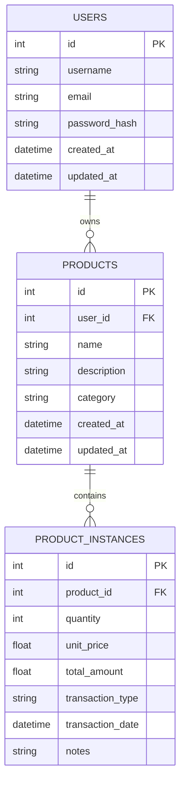
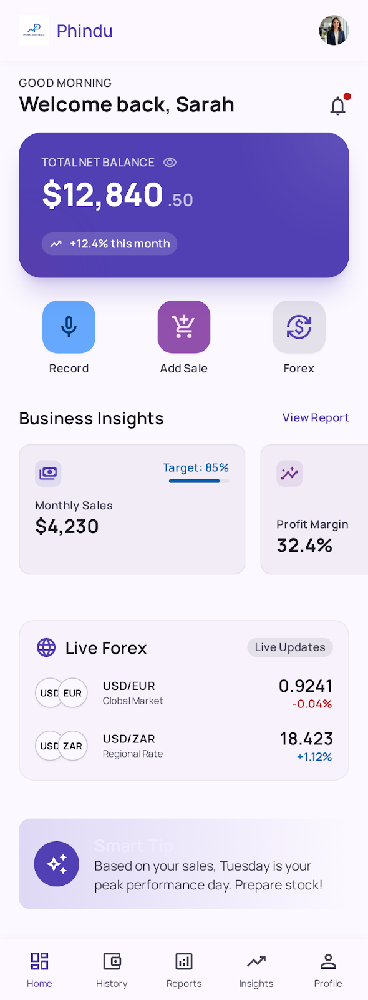
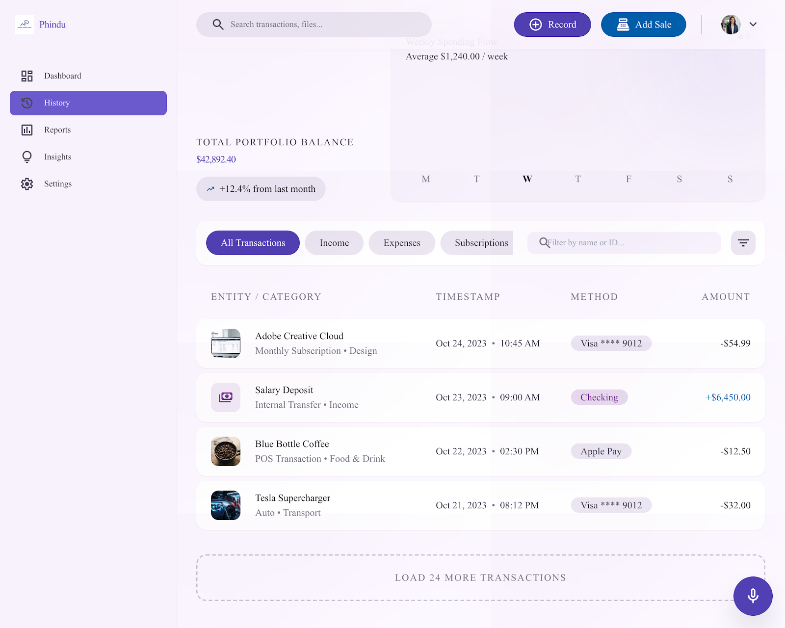
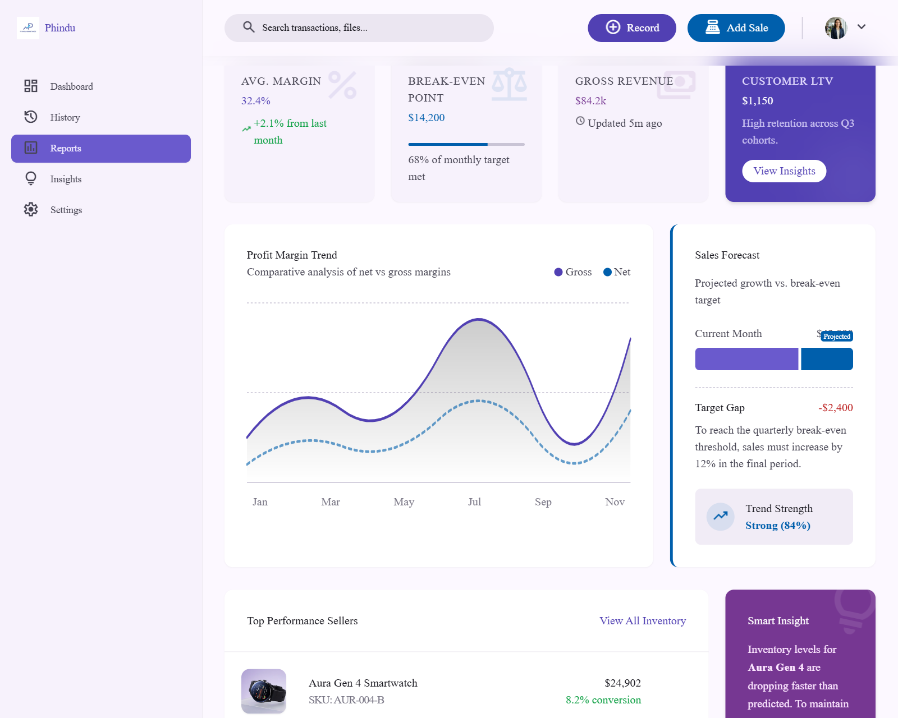
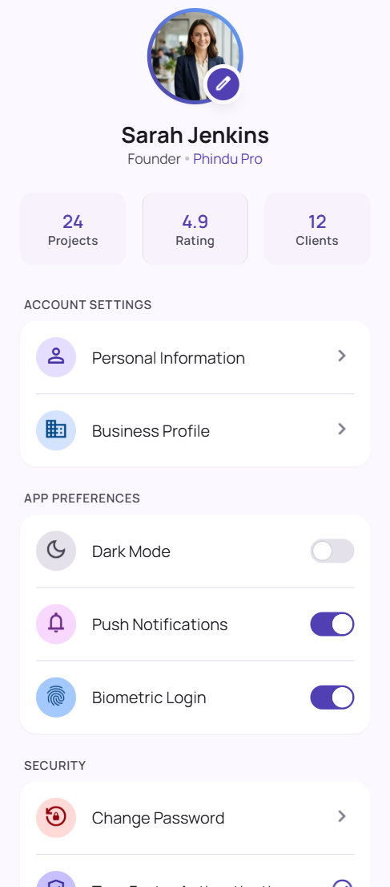
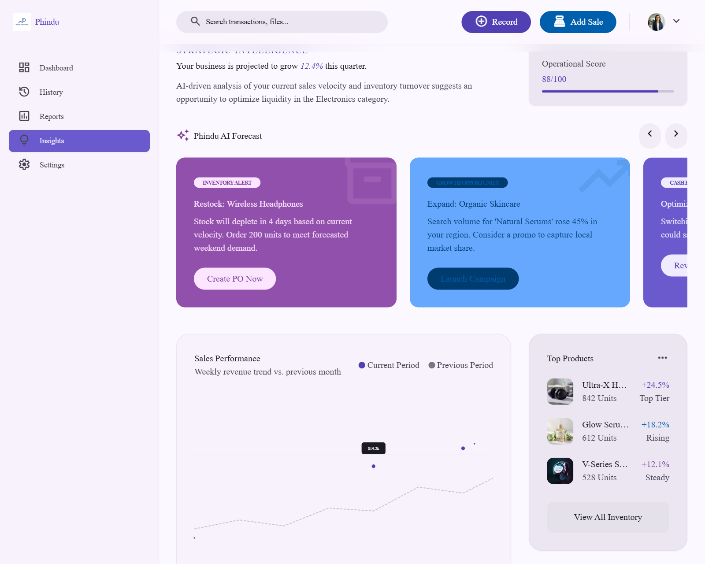
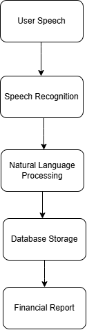

## **FINOVATE HACKATHON PROJECT DOCUMENTATION

   **
   **Voice-enabled Financial Record Management System for Small Business**
   
   **Team Name:** Vonapex 
   **Hackathon:** National Virtual hackathon for Financial Innovation in Malawi 2026
   **Theme:** Financial Innovation for Malawi
   **Date:** 24/07/2026
# Table of Contents

1. [Executive Summary](#1-executive-summary)
2. [Introduction](#2-introduction)
3. [Background](#3-background)
4. [Problem Statement](#4-problem-statement)
5. [Project Objectives](#5-project-objectives)
6. [Scope](#6-scope)
7. [Target Users](#7-target-users)
8. [Proposed Solution](#8-proposed-solution)
9. [Key Features](#9-key-features)
10. [Functional Requirements](#10-functional-requirements)
11. [Non-Functional Requirements](#11-non-functional-requirements)
12. [System Workflow](#12-system-workflow)
13. [System Architecture](#13-system-architecture)
14. [Technology Stack](#14-technology-stack)
15. [Database Design](#15-database-design)
16. [User Interface Design](#16-user-interface-design)
17. [AI and Voice Processing](#17-ai-and-voice-processing)
18. [Security Considerations](#18-security-considerations)
19. [Innovation](#19-innovation)
20. [Business Model](#20-business-model)
21. [Impact on Financial Inclusion](#21-impact-on-financial-inclusion)
22. [Challenges Encountered](#22-challenges-encountered)
23. [Future Enhancements](#23-future-enhancements)
24. [Testing Strategy](#24-testing-strategy)
25. [Team Contributions](#25-team-contributions)
26. [Conclusion](#26-conclusion)
27. [References](#27-references)
28. [Appendices](#28-appendices)
   

## 1. Executive Summary

Small businesses play a significant role in Malawi's economy, many owners still rely on handwritten notebooks, or memory keep financial records. This often results in inaccurate records, poor financial planning, and difficulty accessing financial services.
 This project introduces a voice-enabled financial management system that allows users to record business transaction simply by speaking. This application automatically converts speech into text, extracts financial information, stores it securely, and generates reports without requiring manual data entry. 
 The solution is specifically for entrepreneurs with limited digital literacy and support efficient, accessible, and inclusive financial record keeping.
 

## 2. **Introduction**

Digital transformation has improved financial management for many businesses, but small informal continue to face barriers due to limited digital skills and limited access to affordable bookkeeping tools.
 This project bridges that gap by using speech recognition and artificial intelligence to simplify financial record management.
 

## 3. **Background**
Many informal businesses:
 - keep handwritten records
 - Forget transaction
 - Lose financial books
 - Cannot produce financial statement
 - Strugle to qualify for loans
 
A voice-driven solution removes many of these barriers

## 4. **Problem Statement**
Small business owners spend considerable time recording transactions manually. Many lack computer literacy, making existing account software difficult to use. As a result, businesses experience poor record management, inaccurate financial reporting, and limited opportunities for growth.

## 5. **Project Objectives**
**Main Objective**
To develop a voice-enabled financial management platform for small businesses.

**Specific Objective**

 - Capture business transaction using voice.
 - Convert speech into text.
 - Automatically organize transaction records.
 - Store records securely.
 - Generate financial reports.
 - improve financial inclusion.

## 6. Scope
The system allows users to:

 - Register account.
 - Record transaction using voice.
 - View Transaction history.
 - Generate reports.
 - Manage customer information.
 - Monitor business performance

The current prototype does not include:

 - Bank integration.
 - Mobile Money integration
 - Offline synchronization
## 7. Target Users

The system is designed to serve a range of users involved in small business operations and the broader financial ecosystem that supports them.

### Primary Users

These are the direct, day-to-day users of the platform:

-   Market vendors.
-   Grocery store owners.
-   Informal traders.
-   Small retail businesses.

### Secondary Users

These users engage with the data generated by the platform, rather than recording transactions themselves:

-   Accountants reviewing business records.
-   Financial institutions assessing creditworthiness.
-   Loan officers evaluating loan applications.

----------

## 8. Proposed Solution

The proposed application enables business owners to record sales and expenses simply by speaking, removing the need for manual data entry or advanced digital literacy.

Artificial intelligence converts the spoken input into structured business records, extracting relevant details such as product names, quantities, and prices. The processed data is stored automatically and presented through an intuitive dashboard that provides financial summaries and reports, giving business owners a clear view of their performance at a glance.

----------

## 9. Key Features

The platform offers the following core features to support voice-driven financial record keeping:

-   Voice transaction recording.
-   Speech-to-text conversion.
-   Automatic categorization of transactions.
-   An interactive dashboard.
-   Daily reports.
-   Monthly reports.
-   Profit summaries.
-   Secure login.
-   Cloud storage.
-   User management.

----------

## 10. Functional Requirements

The system shall provide the following functionality:

-   Allow user registration.
-   Authenticate users.
-   Record spoken transactions.
-   Convert voice input into text.
-   Extract relevant business information from transcribed text.
-   Save transaction records.
-   Edit existing transactions.
-   Delete transactions.
-   Generate financial reports.
-   Export reports for external use.

----------

## 11. Non-Functional Requirements

Beyond core functionality, the system is expected to meet the following quality standards:

-   Easy to use, even for users with limited digital literacy.
-   Fast response time during voice processing and data retrieval.
-   Reliable performance under normal operating conditions.
-   Secure handling of user data and transactions.
-   Scalable to support a growing number of users.
-   Mobile responsive design.
-   High availability with minimal downtime.
-   Strong data privacy protections.

----------

## 12. System Workflow

The system follows a straightforward flow from voice input to generated report, as outlined below:

1.  The customer or business owner speaks a transaction aloud.
2.  The speech recognition engine captures the audio input.
3.  The audio is converted into text.
4.  Artificial intelligence extracts key information from the text (e.g., product, quantity, price).
5.  The extracted transaction is validated for accuracy.
6.  The validated data is stored in the database.
7.  The dashboard updates to reflect the new transaction.
8.  Financial reports are generated based on the updated data.

## 13. System Architecture

The system follows a layered architecture, separating concerns across presentation, application, data, and external service layers.

### Presentation Layer

-   Mobile application.
-   Web application.

### Application Layer

-   Backend API.
-   Business logic.
-   AI processing.

### Data Layer

-   Database.
-   Cloud storage.

### External Services

-   Speech recognition engine.
-   Authentication service.

----------

## 14. Technology Stack

The following technologies were selected to build and support the platform:

### Frontend

-   React.
-   Flutter.

### Backend

-   Python.
-   FastAPI.

### Database

-   PostgreSQL.

### Artificial Intelligence

-   OpenAI Whisper.
-   Natural Language Processing (NLP).

### Cloud

-   Firebase / AWS.

### Version Control

-   GitHub.

## 15. Database Design

The database is structured around the following core entities:

-   Users.
-   Businesses.
-   Transactions.
-   Products.
-   Reports.
-   Audit Logs.

## **a. Database Overview**

The Voice-Enabled Financial Record Management System uses a **relational database** to store and manage user information, product details, and sales transactions. The database has been designed using normalization principles to minimize data redundancy, maintain data integrity, and improve scalability.

The system consists of three primary entities:

-   Users
-   Products
-   Product Instances (Sales Transactions)

These entities are linked through **primary keys** and **foreign keys**, ensuring consistency between user accounts, products, and recorded sales.

## **b. Database Architecture**

The database follows a relational model where:

-   A **User** can own multiple products.
-   A **User** can record multiple sales transactions.
-   A **Product** can appear in multiple sales transactions.

This design allows efficient storage and retrieval of business data while avoiding duplication of information.

## c . Database Tables 

## 15.1 Users Table

**Description**
The **Users** table stores information related to registered users of the application. Each record represents a unique business owner or authorized user of the system.

**Purpose**

This table is responsible for:
-   User authentication
-   User identification
-   Account management
-   Security and authorization

## Table Structure

### Table Name: `users`

| Column Name | Data Type | Constraints | Description |
|---|---|---|---|
| `id` | Integer | Primary Key, Auto Increment | Unique identifier assigned to each user |
| `username` | String | Unique, Not Null | Stores the user's name or username |
| `email` | String | Unique, Not Null | Stores the user's email address |
| `password_hash` | String | Not Null | Stores the encrypted user password |
| `created_at` | DateTime | Default Current Timestamp | Records when the user account was created |
| `updated_at` | DateTime | Automatically Updated | Records the last time user information was modified |

### Example Record

| id | username | email | created_at |
|---|---|---|---|
| 1 | Nelson | nelson@example.com | 2026-07-01 10:30:00 |

## 15.2 Products Table

**Description**

The **Products** table stores information about products managed by each business owner. Every product belongs to a specific user.

### Purpose

The `products` table stores information about products or services created and managed by system users.

Each product belongs to a specific user through the `user_id` foreign key. This allows the system to maintain separate product records for different business owners while supporting multiple products under one account.

## Table Structure

### Table Name: `products`

| Column Name | Data Type | Constraints | Description |
|---|---|---|---|
| `id` | Integer | Primary Key, Auto Increment | Unique identifier assigned to each product |
| `user_id` | Integer | Foreign Key, Not Null | Identifies the user who owns the product |
| `name` | String | Not Null | Stores the name of the product or service |
| `description` | String | Nullable | Provides additional details about the product |
| `category` | String | Nullable | Defines the product category or classification |
| `created_at` | DateTime | Default Current Timestamp | Records when the product was created |
| `updated_at` | DateTime | Automatically Updated | Records the last modification date of the product |

### Foreign Key Relationship

SQL
products.user_id → users.id

## 15.3 Product Instances Table

**Description**

The **Product Instances** table records every sales transaction performed within the system. Each record represents an individual sale made by a user.

**Purpose**

This table stores:

-   Products sold
-   Quantity sold
-   Selling price
-   Credit sales
-   Sales history

Unlike the Products table, which stores product definitions, the Product Instances table stores actual business transactions.

## Table Structure

### Table Name: `product_instances`

| Column Name | Data Type | Constraints | Description |
|---|---|---|---|
| `id` | Integer | Primary Key, Auto Increment | Unique identifier assigned to each transaction record |
| `product_id` | Integer | Foreign Key, Not Null | Links the transaction to a specific product |
| `quantity` | Integer | Not Null | Stores the number of products involved in the transaction |
| `unit_price` | Float | Not Null | Stores the selling price of one product unit |
| `total_amount` | Float | Not Null | Stores the total value of the transaction |
| `transaction_type` | String | Not Null | Defines the type of transaction, such as sale or stock addition |
| `transaction_date` | DateTime | Default Current Timestamp | Records when the transaction occurred |
| `notes` | String | Nullable | Stores additional information related to the transaction |

### Foreign Key Relationship

product_instances.product_id → products.id
## d. Entity Relationships

The database tables are related as follows:

**User → Products**

A single user can own multiple products.

Relationship:

**One-to-Many (1:N)**

This relationship enables each business owner to maintain an independent product catalogue.

----------

## User → Product Instances

A single user can create multiple sales transactions.

Relationship:

**One-to-Many (1:N)**

This relationship allows the system to maintain a complete sales history for every registered user.

----------

## Product → Product Instances

A product can appear in multiple sales transactions.

Relationship:

**One-to-Many (1:N)**

This enables the application to generate sales reports and product performance statistics over time.

## e. Entity Relationship Diagram (ERD)

The Entity Relationship Diagram (ERD) illustrates the relationship between the main database entities in the Voice-Enabled Financial Record Management System.

The system consists of three main entities:

- **Users**: Stores registered system users.
- **Products**: Stores products or services owned by users.
- **Product Instances**: Stores individual financial transactions related to products.

## 16. User Interface Design

The interface design covers the primary screens a user interacts with throughout the application. 

**16.1 Login page**. 

   
**16.2 Dashboard page**
The dashboard provides a summary of daily transactions and overall business performance.

**16.3 Transaction history page**
Users can review a detailed log of past transactions.

**16.4 Reports page**
Generated reports summarize financial performance over a selected period.

**16.5 Settings page**
Users can manage account and business preferences here.

**16.6 Business Insights**
 The insights view highlights key performance trends.  

## 17. AI and Voice Processing
The main purpose of the system is to simplify financial record management for small business owners through voice interaction.
Instead of manually entering transactions, users can speak naturally and the system con**verts their speech into structured financial records. 

Speech recognition converts the audio into text, which is then processed using Natural Language Processing to identify key details, including:
-   Product names.
-   Quantities.
-   Prices.
-   Dates

Once identified, this structured information is stored automatically, eliminating the need for manual entry.
## 17.1 Voice Input Process
The voice processing workflow consists of the following stages:
**17.2 Voice Input**
Example:
User says:
"Sold 10 bottles of water at 500 kwacha each"

**17.3 Speech-to-Text Conversion**
Audio:
"Voice Recording"

Converted into:
"Sold 10 bottles of water at 500 kwacha each"

**17.4 Information Extraction**
The system identifies:
| Information      | Extracted Value |
| ---------------- | --------------- |
| Product           | Water            |
| Quantity          | 10               |
| Unit Price        | 500              |
| Transaction Type  | Sale             |
**17.2 System Workflow**
The following diagram illustrates the flow from voice input to generated report:

## 18. Security Considerations
To protect user data and maintain trust, the system incorporates the following security measures:
-   Password encryption.
-   Secure authentication.
-   User authorization controls.
-   HTTPS communication.
-   Database encryption.
-   Regular data backup.

## 19. Innovation

Unlike traditional bookkeeping systems that rely on manual entry or typed input, this solution allows business owners to manage financial records naturally through voice interaction.

By reducing manual work, the platform improves accessibility for users with limited digital literacy, making financial record keeping achievable for a wider range of small business owners.

## 20. Business Model

The platform's sustainability is supported by several potential revenue streams:

-   Monthly subscriptions.
-   Premium analytics for deeper financial insights.
-   Partnerships with financial institutions.
-   Business management packages for growing enterprises.

## 21. Impact on Financial Inclusion

The platform promotes financial inclusion by enabling informal businesses to maintain accurate, consistent financial records.

Reliable financial records, in turn, improve business owners' access to:

-   Loans.
-   Investment opportunities.
-   Business growth support.
-   Financial planning resources.

## 22. Challenges Encountered

During development, the team encountered the following challenges:

-   Background noise affecting voice recognition accuracy.
-   General speech recognition accuracy issues.
-   Difficulty recognizing varied accents.
-   Time constraints during the hackathon period.
-   Complexities in API integration.
-   Limited training data for local speech patterns.

## 23. Future Enhancements

Building on the current prototype, the following enhancements are planned for future development:

-   Chichewa voice recognition support.
-   Offline functionality.
-   Inventory management features.
-   Mobile money integration.
-   Bank integration.
-   Tax reporting capabilities.
-   Receipt scanning.
-   AI-powered financial advice.

## 24. Testing Strategy

To ensure the reliability and quality of the system, the following types of testing were performed:

-   Unit testing.
-   Integration testing.
-   User acceptance testing.
-   Performance testing.
-   Security testing.

## 25. Team Contributions

The project was completed through the collaborative effort of team members across the following roles:

-   Project Manager.
-   Documentation.
-   UI/UX Design.
-   Frontend Development.
-   Backend Development.

## 26. Conclusion

This project demonstrates how artificial intelligence and speech recognition can simplify financial record keeping for small businesses. By reducing manual data entry and improving accessibility, the platform empowers entrepreneurs to make informed financial decisions while promoting financial inclusion across Malawi's informal business sector.

## 27. References
The following types of sources should be cited to support the project's technical and contextual claims:

1. OpenAI. (2024). [*Whisper: Robust Speech Recognition via Large-Scale Weak Supervision*](https://openai.com/research/whisper)

2. FastAPI. (2026). [*FastAPI Documentation*](https://fastapi.tiangolo.com/)

3. React. (2026). [*React Documentation*](https://react.dev/)

4. Flutter. (2026). [*Flutter Documentation*](https://docs.flutter.dev/)

5. PostgreSQL Global Development Group. (2026). [*PostgreSQL Documentation*](https://www.postgresql.org/docs/)

6. Firebase. (2026). [*Firebase Documentation*](https://firebase.google.com/docs)

7. Amazon Web Services. (2026). [*AWS Documentation*](https://docs.aws.amazon.com/)

8. GitHub. (2026). [*GitHub Docs*](https://docs.github.com/)

9. Reserve Bank of Malawi. (2025). [*Financial Inclusion Report*](https://www.rbm.mw/)

10. GSMA. (2024). [*State of the Industry Report on Mobile Money*](https://www.gsma.com/mobilefordevelopment/)

11. World Bank. (2023). [*Financial Inclusion in Sub-Saharan Africa*](https://www.worldbank.org/en/topic/financialinclusion)

12. Mazibuko, C. (2023). [*Challenges and prospects faced by small medium enterprises (SMEs) in terms of growth and development (case study of Lilongwe district, Malawi)*](https://ijhssm.org/issue_dcp/Challenges%20and%20prospects%20faced%20by%20small%20medium%20enterprises%20(SMES)%20in%20terms%20of%20growth%20and%20development%20(case%20study%20of%20Lilongwe%20district,%20Malawi).pdf). International Journal of Humanities Social Science and Management (IJHSSM), 3(2), 962–965.

13. Trade, Investment, and Private Sector Development Partners (TIPDeP). (2024, October 4). [*Micro, Small and Medium Enterprises in Malawi: Sector brief*](https://docs.dcafs-tipdep-donors-mw.org/dt_docs/MSME_Brief_TIPDeP_October_2024_TIPDeP.pdf)

## 28. Appendices

The following supporting materials are included as appendices:

-   **Appendix A** – UI Mockups
-   **Appendix B** – Database Schema
-   **Appendix C** – ER Diagram
-   **Appendix D** – System Architecture Diagram
-   **Appendix E** – User Stories
-   **Appendix F** – Test Cases
-   **Appendix G** – Installation Guide
-   **Appendix H** – GitHub Repository Link

